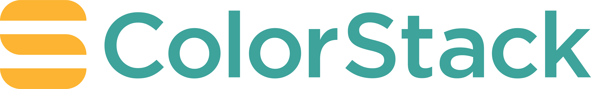

<h1 align="center" href="https://github.com/colorstackorg/oyster">
    
</h1>

<p align="center"><b>Oyster</b>: The open-source software that powers the ColorStack community experience. ✊🏿✊🏾✊🏽✊🏼</p>

<h4 align="center">
  <a href="https://github.com/colorstackorg/oyster/blob/main/CONTRIBUTING.md">How to Contribute</a> |
  <a href="https://colorstack.org">Website</a> |
  <a href="https://app.colorstack.io/apply">Family Application</a>
</h4>


## Applications

- [**Member Profile**](./apps/member-profile/package.json) - Serves as the home
  for a ColorStack member, allowing them to manage their information, find and
  connect with other members, as well as events and gamification.
- [**Admin Dashboard**](./apps/admin-dashboard/package.json) - An internal
  dashboard that the ColorStack team uses to manage important workflows like
  application review.
- [**API**](./apps/api/package.json) - Handles all background jobs as well as
  any webhook integrations that we have with external services.

## Understanding the Codebase

### Important Tools & Technologies

Here is a list of important tools and technologies that power the ColorStack
codebase:

- [BullMQ](https://docs.bullmq.io) to queue and process jobs asynchronously (in
  the background).
- [Kysely](https://kysely.dev) to query our SQL database in a type-safe way.
- [Node.js](https://nodejs.org/en/about)...because yes!
- [PostgreSQL](https://www.postgresql.org/docs/15/index.html) to store all of
  our data.
- [Railway](https://railway.app) to host our applications and databases.
- [Redis](https://redis.io) to store simple key/value based data.
- [Remix](https://remix.run)/[React](https://react.dev) to build fast,
  accessible and delightful UI experiences.
- [Tailwind](https://tailwindcss.com) because scaling CSS is hard.
- [Turborepo](https://turbo.build/repo) to manage the build system for our
  Typescript monorepo.
- [Typescript](https://www.typescriptlang.org) because we like Javascript...and
  we like type checking.
- [Zod](https://zod.dev) to validate all of our data and automatically generate
  types.

### Folder Structure

Here is the structure of our Typescript monorepo:

```
apps
|--- admin-dashboard
|--- api
|--- member-profile
packages
|--- core
|--- db
|--- email-templates
|--- types
|--- ui
|--- utils
```

The `apps` directory houses all of our applications (see "Applications"
section).

The `packages` directory contains reusable pieces of code that are used across
our applications.

- `core`: Nearly all of our core business logic. Will eventually colocate
  feature-based UI next to its related business logic.
- `db`: Database layer, which houses all migrations, database scripts (ie:
  `seed`) and testing utilities that involve the database.
- `email-templates`: React-based email templates built with
  [Resend](https://resend.com).
- `types`: Miscellaneous types shared across applications.
- `ui`: Reusable UI components built in React.
- `utils`: Reusable utility functions, such as `sleep`.

### CI Pipeline (GitHub Actions)

To ensure that we don't have any breaking changes, we have a GitHub Actions
workflow that runs, which can block a PR from being merged if certain checks
don't pass.

For more information on how that CI pipeline works, see
[this](./.github/workflows/ci.yml) file.

### Deployment

We use [Railway](https://railway.app) to host our applications as well as our
PostgreSQL and Redis databases. Whenever we make some changes to our `main`
branch, Railway will automatically pick up those changes and deploy a new
version of our applications.

Each application has a `railway.json` file where we can configure certain
settings and instructions so Railway knows _how and when_ to build/start our
application. See [this](./apps/api/railway.json) file as an example. For a full
list on what we can configure, see
[here](https://docs.railway.app/reference/config-as-code#configurable-settings).

## Contributing

Please see our [contributing guide](./CONTRIBUTING.md)! 👋

A heartfelt thanks to our ColorStack members for their contributions! 🙏

<a href="https://github.com/colorstackorg/oyster/graphs/contributors">
  
</a>

Made with [contrib.rocks](https://contrib.rocks).
